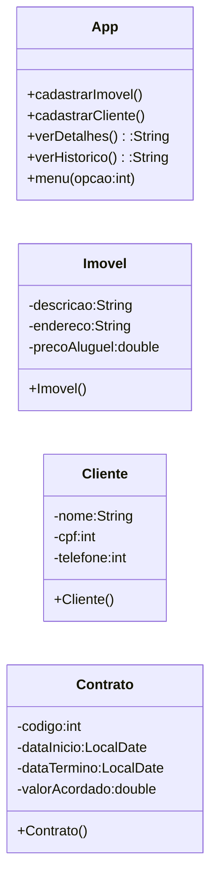

```mermaid
classDiagram
    direction LR
    
    
    class App{
        +cadastrarImovel()
        +cadastrarCliente()
        +verDetalhes():String
        +verHistorico():String
        +menu(opcao:int)
    }
    
    class Imovel{
        -descricao:String
        -endereco:String
        -precoAluguel:double
        +Imovel()
    }
    
    class Cliente{
        -nome:String
        -cpf:int
        -telefone:int
        +Cliente()
    }
    
    class Contrato{
        -codigo:int
        -dataInicio:LocalDate
        -dataTermino:LocalDate
        -valorAcordado:double
        +Contrato()
    }

```